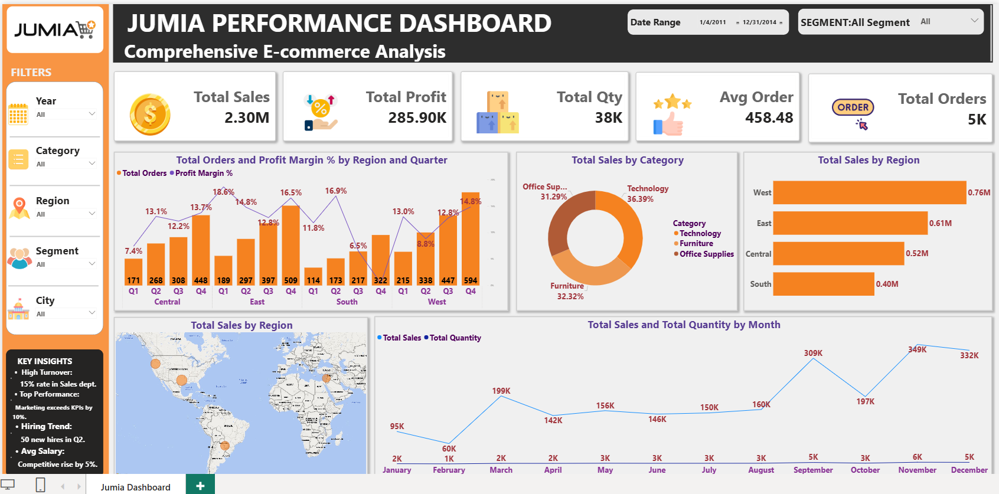

# Jumia Performance Dashboard | Power BI

An interactive **Power BI** dashboard analyzing Jumia's e-commerce performance — sales, profitability, regional distribution, and monthly trends — built to support data-driven business decisions.

## 📌 Overview

This dashboard consolidates order-level e-commerce data (2011–2014) into a single interactive view, enabling stakeholders to filter by **Year, Category, Region, Segment, and City**, and instantly see how sales, profit, and order volume respond.

## 🎯 Key KPIs

| Metric | Value |
|---|---|
| Total Sales | 2.30M |
| Total Profit | 285.90K |
| Total Quantity | 38K |
| Average Order Value | 458.48 |
| Total Orders | 5K |

## 🧱 Data Model

Built on a **Star Schema**: a central `Fact_Sales` table (Sales, Profit, Quantity, OrderID) connected to dimension tables — `Dim_Date`, `Dim_Category`, `Dim_Region`, `Dim_Segment`, and `Dim_Customer` — for fast filtering and clean, duplication-free DAX measures.

## 📊 Dashboard Pages / Visuals

- **Total Orders & Profit Margin % by Region and Quarter** — combo chart tracking order volume alongside profitability efficiency across Central, East, South, and West.
- **Total Sales by Category** — donut chart breaking down revenue share across Technology, Furniture, and Office Supplies.
- **Total Sales by Region** — bar chart ranking regional performance.
- **Total Sales by Region (Map)** — geographic bubble map of sales concentration.
- **Total Sales and Total Quantity by Month** — trend line highlighting seasonality, with a clear peak around Q4 (September and November).

## 🔎 Key Insights

- **West** is the top-performing region by both order volume and total sales (0.76M).
- **East – Q3** posted the highest profit margin (16.5%), signaling room to grow share there.
- **South** underperforms across most quarters, indicating a candidate area for a deeper root-cause review (marketing reach, product availability, or purchasing power).
- Sales show clear **seasonality**, peaking in **September** and **November** — useful for inventory and campaign planning ahead of Q4.

## 🛠️ Tools & Techniques

- **Power Query** — data cleaning & transformation
- **Data Modeling** — Star Schema, relationships
- **DAX** — KPI measures, ratios, time intelligence
- **Power BI** — interactive slicers, combo charts, map visuals, dashboard UX design

## 📂 Files in this Repo

- `jumia-dashboard-overview.png` — full dashboard screenshot
- `Jumia_Performance_Dashboard_Documentation.pptx` — full project documentation (data model, KPI logic, insights)

## 👤 Author

**Sameh Sabry El-Hosary**
Data Analyst | Business Intelligence Analyst
[Portfolio](#) • [LinkedIn](#)
